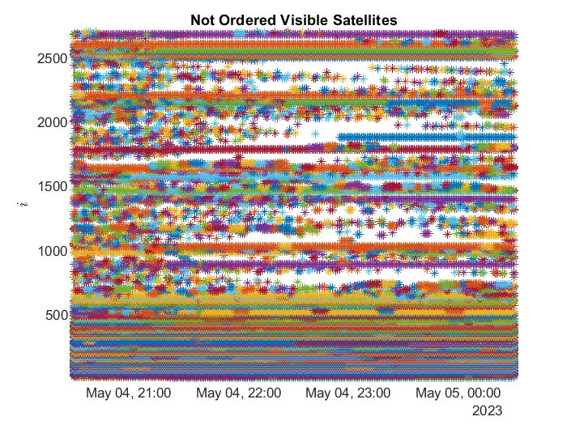
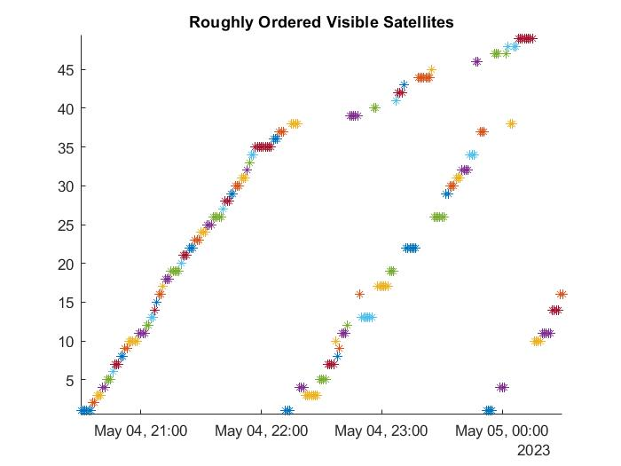

# Satellite Observer

The aim of this project was that of creating a software which could help the observation procedure of satellites from a specific location at a specific time. The satellite informations are acquired by the loading of a list of TLEs, which will then be propagated using the SGP4 software. Then, a visibility check is performed and finally the conflicts are resolved using a score system. The output of the program is a graphical representation of the satellites which are visible from the observatory location at the specified time and an 'Orchestrate.txt' file which will contain all the informations for a succesful observation window.

Rough Propagation Raw Results            |  Application of Conflict Resolution
-------------------------|-------------------------
 | 

### Table of Contents
- [Initialization and Data Reading](#initialization-and-data-reading)
- [Rough Propagation](#rough-propagation)
- [Conflict Resolution](#conflict-resolution)
- [Precise Propagation](#precise-propagation)
- [Orchestrate File Creation](#orchestrate-file-creation)

## Initialization and Data Reading

In this stage, the environment is prepared for the computation process. The program updates and reads the required data from the Two Line Element (TLE) and Earth Orientation Parameters (EOP) files. 
Moreover, this is the section in which we define the observatory location and the time domain related to the observation window.
Finally, the satellites structure is initialized. This structure will contain all the informations related to the satellites such as name, position, visibility, etc.

## Rough Propagation

Once everything is set up, the program starts the rough propagation. This first propagation will have a step of 1 minute and will be useful to approximately identify the satellites which will be visible from the observatory location.
The propagation is performed using the SGP4 software, which is a simplified perturbative model to calculate the position and velocity of an Earth-orbiting satellite. The model is based on the Simplified General Perturbations 4 (SGP4) theory, which is a modification of the Simplified Perturbations 2 (SGP2) theory. The SGP4 theory is used to calculate the position and velocity of a satellite at any time given the orbital elements defined in the TLE. The SGP4 theory is valid for near-Earth orbits with an orbital period of fewer than 225 minutes. The SGP4 theory is described in the following paper: *Spacetrack Report No. 3: Models for Propagation of NORAD Element Sets*, Hoots, Felix R. and Roehrich, Ronald L., December 1980.

The Visibility Check is performed by checking if the satellite is illuminated by the Sun, if the observatory is in the dark and if the satellite is over the mask angle. If all these conditions are satisfied, the satellite is considered visible from the observatory location.

The results of the rough propagation are then saved, and unobservable satellites are removed.

## Conflict Resolution

Once the rough propagation is completed, the program starts the conflict resolution process. This process is performed by assigning a score to each satellite based on the following principles:
* Any satellite should be visible for at least 3 minutes consecutively.
* LEO satellites are preferred over GEO satellites since typically their observability window is smaller.
* Once a satellite has been observed at least once, it is preferred to keep its streak going until a maximum of N observations, where N is an adjustable threshold.
* Among all satellites, it is convenient to observe the one with the total observation time closest to the average observation time of its peers.

## Precise Propagation

Once the Conflict Resolution has been completed, the program starts the precise propagation. This propagation is again performed using the SGP4 software, but this time with a time step of 1 second in order to increase the accuracy of the results.

At the end of the propagation, we apply the same filters applied on the rough propagation but this time we will not be required to resolve any conflict.

## Orchestrate File Creation

The final step for this program is the creation of the Orchestrate file. This file will contain all the informations required to perform a succesful observation under the form of a list of commands containing Right Ascension, Declination, Time of Shooting and Exposure Time.

Please note that this program requires the necessary TLE and EOP files in the specified paths. Ensure that you have the necessary permissions to read these files.

**Contributor:** Leonardo Russo

**Last Updated:** 05/05/2023
